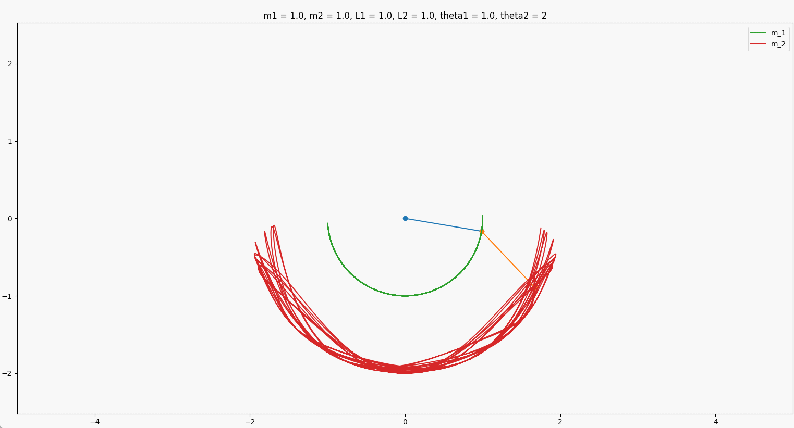

# Codes for 2022 General Physics Midterm Exam


# Tested Environment

* Windows 11 Pro (64)
* Python 3.10
* Windows Terminal(Optional)

# Installation

```bash
git clone https://github.com/ja-errorpro/GeneralPhysicsMidtermExam.git
cd GeneralPhysicsMidtermExam
pip install -r requirements.txt
```

# Issues

  Google Colab PiP無法安裝WxPython，需使用conda安裝或於本機環境模擬

# Run

```bash
python3 <filename> 
```

# Screenshots


